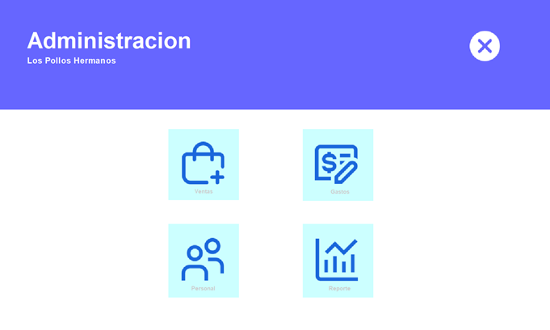

# Restaurant Management System




## About

**Restaurant Management System** is a software application designed to streamline the sales process for restaurants. It enables better organization of sales records, automates invoice and receipt generation, and facilitates employee management. This system helps improve efficiency and accuracy in the restaurant’s daily operations.

- **Main Features:**
  - Sales Tracking
  - Invoice and Receipt Generation
  - Employee Management
  - Expense Tracking
  - Report Generation

## Installation

1. **Clone the Repository:**
   - To clone the repository, run the following command in your terminal:
     ```bash
     git clone https://github.com/Gatorrante/Sistema-de-gestion-para-restaurantes.git
     ```

2. **Setup Database:**
   - The database schema and scripts are located in the `recursos` folder within `recursos/Database.sql`. Import this file into your SQL database management system to set up the required database schema.

3. **Compile and Run:**
   - Open the project in NetBeans.
   - Build the project by selecting `Build` from the `Run` menu or pressing `F11`.
   - Run the application by selecting `Run` from the `Run` menu or pressing `F6`.

## Screenshots

- **Main Screen:**
  

- **Income Screen:**
  

- **UML Diagram:**
  

## Usage

1. **Login:**
   - Access the system using the login screen.

2. **Menu:**
   - Navigate through the menu options: “Expenses”, “Income”, “Personnel”, and “Reports”.

3. **Expense Management:**
   - Register and manage expenses.

4. **Income Management:**
   - Add or remove items from sales.

5. **Personnel Management:**
   - Manage and register employees.

6. **Reports:**
   - View and generate reports on sales, expenses, and employee records.

## Links

- [Clone Repository](https://github.com/Gatorrante/Sistema-de-gestion-para-restaurantes.git)

<details>
  <summary>Leer en Español</summary>

  # Sistema de Gestión para Restaurantes

  
  
  

  

  ## Acerca de

  **Sistema de Gestión para Restaurantes** es una aplicación de software diseñada para agilizar el proceso de ventas en restaurantes. Permite una mejor organización de los registros de ventas, automatiza la generación de facturas y recibos, y facilita la gestión de empleados. Este sistema ayuda a mejorar la eficiencia y precisión en las operaciones diarias del restaurante.

  - **Principales Características:**
    - Seguimiento de Ventas
    - Generación de Facturas y Recibos
    - Gestión de Empleados
    - Seguimiento de Gastos
    - Generación de Reportes

  ## Instalación

  1. **Clonar el Repositorio:**
     - Para clonar el repositorio, ejecuta el siguiente comando en tu terminal:
       ```bash
       git clone https://github.com/Gatorrante/Sistema-de-gestion-para-restaurantes.git
       ```

  2. **Configurar la Base de Datos:**
     - El esquema y los scripts de la base de datos se encuentran en la carpeta `recursos` bajo `recursos/Database.sql`. Importa este archivo en tu sistema de gestión de bases de datos SQL para configurar el esquema de la base de datos necesario.

  3. **Compilar y Ejecutar:**
     - Abre el proyecto en NetBeans.
     - Compila el proyecto seleccionando `Build` en el menú `Run` o presionando `F11`.
     - Ejecuta la aplicación seleccionando `Run` en el menú `Run` o presionando `F6`.

  ## Capturas de Pantalla

  - **Pantalla Principal:**
    

  - **Pantalla de Ingresos:**
    

  - **Diagrama UML:**
    

  ## Uso

  1. **Inicio de Sesión:**
     - Accede al sistema usando la pantalla de inicio de sesión.

  2. **Menú:**
     - Navega por las opciones del menú: “Egresos”, “Ingresos”, “Personal” y “Reportes”.

  3. **Gestión de Gastos:**
     - Registra y gestiona los gastos.

  4. **Gestión de Ingresos:**
     - Agrega o elimina artículos de las ventas.

  5. **Gestión de Personal:**
     - Gestiona y registra empleados.

  6. **Reportes:**
     - Visualiza y genera reportes sobre ventas, gastos y registros de empleados.

  ## Enlaces

  - [Clonar Repositorio](https://github.com/Gatorrante/Sistema-de-gestion-para-restaurantes.git)
</details>
